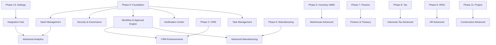

# ERP Gap Analysis & Enhancement Roadmap

> **Dokumen:** Gap analysis kekurangan ERP saat ini dan rekomendasi penambahan modul untuk mencapai level **enterprise SaaS-ready ERP**.
> **Referensi:** [ERP_IMPLEMENTATION_PLAN.md](./ERP_IMPLEMENTATION_PLAN.md)
> **Terakhir diperbarui:** 2026-04-13

---

## Legenda Status

| Simbol | Keterangan |
|--------|-----------|
| `[ ]`  | Belum dikerjakan |
| `[/]`  | Sedang dikerjakan |
| `[x]`  | Selesai |
| `[-]`  | Ditunda / Di-skip (sementara) |

---

## Implementation Priority Tiers

| Tier | Level | Modul |
|------|-------|-------|
| **Tier 1** | 🔴 Critical | Task Management, Advanced Approval Engine, Notification Center, SaaS Management |
| **Tier 2** | 🟠 High Value | CRM Enhancements, Warehouse Advanced, Finance Treasury, Integration Hub |
| **Tier 3** | 🟡 Scaling | Advanced Analytics, HR LMS, Construction Advanced, Data Warehouse |

---

## 1. Core Cross-Module Enhancements

> **Tier:** 🔴 Tier 1 — Critical
> **Dependency:** Harus selesai sebelum modul bisnis lainnya berjalan optimal.

### 1.1 Workflow & Approval Engine

| # | Fitur | Status | Catatan |
|---|-------|--------|---------|
| 1 | Multi-Level Approval Rules | `[ ]` | Rule berbasis nilai, cost center, cabang |
| 2 | SLA & Escalation | `[ ]` | Waktu batas per step + auto-eskalasi |
| 3 | Approval History Tracking | `[ ]` | Log siapa approve/reject + timestamp |
| 4 | Delegation (Substitute Approver) | `[ ]` | Pengalihan approver saat cuti |

**Checklist Implementasi:**
- [ ] Desain skema DB: `workflow_definition`, `workflow_step`, `workflow_rule`, `workflow_instance`, `approval_history`
- [ ] API: CRUD workflow definition + trigger workflow instance
- [ ] API: Action endpoint (approve / reject / delegate / escalate)
- [ ] Background job: SLA checker & escalation scheduler (BullMQ)
- [ ] UI: Workflow designer (visual step builder)
- [ ] UI: Inbox approval per user
- [ ] UI: History tracking per dokumen
- [ ] UI: Delegation management (assignee + date range)
- [ ] Testing: Unit test rule engine, integration test end-to-end approval

---

### 1.2 Notification Center

| # | Fitur | Status | Catatan |
|---|-------|--------|---------|
| 1 | Email Gateway | `[ ]` | SMTP / transactional email service |
| 2 | WhatsApp Gateway | `[ ]` | WhatsApp Business API |
| 3 | SMS Gateway | `[ ]` | SMS provider (Twilio / Zenziva / dll) |
| 4 | In-App Notification | `[ ]` | Real-time notification dalam aplikasi |
| 5 | Reminder & Scheduler | `[ ]` | Reminder terjadwal (jatuh tempo, kontrak) |
| 6 | Event Trigger Engine | `[ ]` | Trigger notifikasi dari event sistem |

**Checklist Implementasi:**
- [ ] Desain skema DB: `notification_template`, `notification_log`, `notification_preference`
- [ ] Queue (BullMQ): `notification.queue` — driver: email/WA/SMS/in-app
- [ ] Service: Template engine (variabel substitusi)
- [ ] API: Notification preference per user
- [ ] API: Admin — CRUD template & channel config (per tenant)
- [ ] WebSocket / SSE: Real-time in-app notification
- [ ] UI: Notification bell + dropdown list + mark as read
- [ ] UI: Notification preference page (channel toggle)
- [ ] UI: Admin — Template management & send history
- [ ] Testing: Unit test template render, integration test channel dispatch

**Task Breakdown Per Sprint:**

**Sprint 1 — Foundation & Data Model**
- [ ] Finalisasi scope MVP Notification Center: email + in-app sebagai prioritas awal
- [ ] Definisikan entity inti: `notification_template`, `notification_log`, `notification_preference`, `notification_channel_config`
- [ ] Tambahkan migration Prisma untuk seluruh entity notification
- [ ] Buat enum/status standar: channel, delivery status, trigger source, priority
- [ ] Siapkan seed data template default per tenant/module
- [ ] Tambahkan permission baru: `notification.read`, `notification.manage`, `notification.preference.manage`
- [ ] Buat dokumen event taxonomy: event apa saja yang boleh memicu notifikasi

**Sprint 2 — Backend Core Service**
- [ ] Implement `NotificationModule` di backend dan daftarkan ke `AppModule`
- [ ] Buat template renderer sederhana untuk variabel substitusi
- [ ] Buat service dispatcher dengan abstraction per channel: email, in-app, WA, SMS
- [ ] Buat `notification.queue` di BullMQ untuk async dispatch
- [ ] Buat fallback logging untuk setiap dispatch success/failure
- [ ] Tambahkan idempotency key agar event yang sama tidak mengirim duplikat
- [ ] Tambahkan rate limit dasar per tenant/channel

**Sprint 3 — API User & Admin**
- [ ] API user: list notification, unread count, mark as read, mark all as read
- [ ] API user: get/update `notification_preference`
- [ ] API admin: CRUD `notification_template`
- [ ] API admin: CRUD `notification_channel_config` per tenant
- [ ] API admin: resend failed notification
- [ ] API admin: notification history dengan filter channel/status/date
- [ ] Tambahkan audit log untuk perubahan template dan channel config

**Sprint 4 — In-App Realtime Experience**
- [ ] Implement WebSocket atau SSE untuk push in-app notification
- [ ] UI: notification bell di layout utama
- [ ] UI: dropdown list notifikasi terbaru
- [ ] UI: unread badge counter
- [ ] UI: mark as read / mark all as read
- [ ] UI: halaman notification center untuk history user
- [ ] Tangani reconnect/retry jika koneksi realtime terputus

**Sprint 5 — Preferences & Admin UI**
- [ ] UI: preference page per user untuk toggle channel
- [ ] UI: admin page untuk template management
- [ ] UI: admin page untuk send history / delivery log
- [ ] UI: admin form untuk channel config tenant
- [ ] Tambahkan preview template render sebelum template diaktifkan
- [ ] Tambahkan validasi placeholder agar template tidak rusak saat disimpan

**Sprint 6 — Reminder & Event Trigger Engine**
- [ ] Buat event trigger registry untuk modul lintas domain
- [ ] Hubungkan trigger awal: approval pending, invoice overdue, kontrak jatuh tempo, task deadline
- [ ] Buat scheduler/reminder job terjadwal berbasis BullMQ
- [ ] Tambahkan retry policy dan dead-letter handling untuk dispatch gagal
- [ ] Tambahkan deduplication untuk reminder periodik
- [ ] Tambahkan observability: metric job processed, failed, retry count

**Sprint 7 — External Channel Expansion**
- [ ] Integrasi Email Gateway production-ready (SMTP/provider)
- [ ] Integrasi WhatsApp Gateway dengan adapter terpisah
- [ ] Integrasi SMS Gateway dengan adapter terpisah
- [ ] Tambahkan channel capability matrix per tenant
- [ ] Tambahkan fallback routing: WA/SMS gagal -> email/in-app bila diizinkan
- [ ] Tambahkan masking/encryption untuk credential channel config

**Sprint 8 — Hardening & Testing**
- [ ] Unit test template renderer
- [ ] Unit test preference resolution dan channel selection
- [ ] Integration test queue dispatch end-to-end
- [ ] Integration test realtime in-app notification
- [ ] Tambahkan load test ringan untuk unread counter dan burst dispatch
- [ ] Tambahkan failure scenario test untuk provider timeout / retry
- [ ] Final review security untuk secret management, auditability, dan tenant isolation

**Definition of Done MVP:**
- [ ] User menerima notifikasi in-app real-time
- [ ] Admin dapat membuat template notification per tenant
- [ ] User dapat mengatur preference channel notifikasi
- [ ] Event bisnis utama dapat memicu notifikasi otomatis
- [ ] Semua pengiriman tercatat di `notification_log`
- [ ] Ada minimal 1 channel eksternal aktif selain in-app
- [ ] Test unit dan integration untuk alur inti lulus

---

### 1.3 Task Management

| # | Fitur | Status | Catatan |
|---|-------|--------|---------|
| 1 | Task Board (Kanban) | `[ ]` | Drag-and-drop status task |
| 2 | Assignment & Deadline | `[ ]` | Assign ke user + tanggal deadline |
| 3 | Activity Log | `[ ]` | Riwayat perubahan task |
| 4 | Reminder & Follow-up | `[ ]` | Notifikasi sebelum deadline |

**Checklist Implementasi:**
- [ ] Desain skema DB: `task`, `task_board`, `task_comment`, `task_activity_log`
- [ ] API: CRUD task + assign + status change + bulk update
- [ ] API: Task filter (by assignee, deadline, status, module-linked entity)
- [ ] Background job: Deadline reminder scheduler
- [ ] UI: Kanban board per project/modul
- [ ] UI: List view + detail panel
- [ ] UI: Activity log timeline per task
- [ ] Integration: Link task ke entity lain (SO, PO, PR, dll)
- [ ] Testing: Unit test deadline logic, E2E board scenario

---

## 2. CRM Enhancements

> **Tier:** 🟠 Tier 2 — High Value
> **Dependency:** Phase 2 (CRM dasar) harus selesai.

| # | Fitur | Status | Catatan |
|---|-------|--------|---------|
| 1 | Sales Funnel Dashboard | `[ ]` | Visualisasi pipeline konversi |
| 2 | Lead Scoring | `[ ]` | Scoring otomatis berdasarkan aktivitas |
| 3 | Email Integration (Gmail / Outlook) | `[ ]` | Sync email ke CRM activity |
| 4 | Customer 360 Profile | `[ ]` | View lengkap customer (transaksi, tiket, dll) |
| 5 | Contract Management | `[ ]` | Kontrak customer + renewal tracking |

**Checklist Implementasi:**
- [ ] Desain skema DB: `lead_score_rule`, `lead_score_log`, `customer_contract`, `email_sync_log`
- [ ] API: Lead scoring engine (rule-based atau weighted)
- [ ] API: Customer 360 aggregator endpoint
- [ ] API: Contract CRUD + renewal reminder trigger
- [ ] Integration: OAuth Gmail/Outlook + email sync job (BullMQ)
- [ ] UI: Sales funnel/pipeline dashboard (chart + drilldown)
- [ ] UI: Lead detail dengan score history
- [ ] UI: Customer 360 profile page
- [ ] UI: Contract list + detail + timeline
- [ ] Testing: Scoring rule unit test, OAuth integration test

---

## 3. Advanced Manufacturing

> **Tier:** 🟡 Tier 3 — Scaling
> **Dependency:** Phase 6 (Manufacturing dasar) harus selesai.

| # | Fitur | Status | Catatan |
|---|-------|--------|---------|
| 1 | Demand Forecasting | `[ ]` | Prediksi permintaan berdasarkan histori |
| 2 | Capacity Planning | `[ ]` | Perencanaan kapasitas work center |
| 3 | Subcontracting | `[ ]` | Kirim material ke vendor, terima hasil |
| 4 | Production Simulation | `[ ]` | Simulasi jadwal produksi |

**Checklist Implementasi:**
- [ ] Desain skema DB: `demand_forecast`, `capacity_plan`, `subcontract_order`, `simulation_run`
- [ ] Service: Forecast engine (simple moving average / exponential smoothing)
- [ ] Service: Capacity constraint solver
- [ ] API: CRUD subcontract order + GR from subcontractor
- [ ] Background job: Forecast recalculation (BullMQ)
- [ ] UI: Forecast dashboard (chart + adj)
- [ ] UI: Capacity planning calendar view
- [ ] UI: Subcontracting order list + receiving
- [ ] Testing: Forecast accuracy unit test, capacity constraint test

---

## 4. Warehouse Advanced Features

> **Tier:** 🟠 Tier 2 — High Value
> **Dependency:** Phase 5 (Inventory & WMS dasar) harus selesai.

| # | Fitur | Status | Catatan |
|---|-------|--------|---------|
| 1 | Barcode / QR Integration | `[ ]` | Scan untuk receive/pick/transfer |
| 2 | Slotting Optimization | `[ ]` | Rekomendasi penempatan item di bin |
| 3 | Cross Docking | `[ ]` | Transfer langsung tanpa putaway |
| 4 | Returns (RMA) | `[ ]` | Return merchandise authorization |
| 5 | Cycle Counting | `[ ]` | Stock opname sebagian/berkala |

**Checklist Implementasi:**
- [ ] Desain skema DB: `barcode_scan_log`, `slotting_rule`, `cross_dock_order`, `rma`, `cycle_count`
- [ ] API: Barcode scan endpoint (validate + execute action)
- [ ] API: CRUD RMA + impact ke stok & AR
- [ ] API: Cycle count session + reconciliation
- [ ] Service: Slotting recommendation engine (rule-based)
- [ ] UI: Barcode scanner UI (camera / laser input)
- [ ] UI: Slotting management page
- [ ] UI: Cross dock order management
- [ ] UI: RMA list + approval + restock/scrap action
- [ ] UI: Cycle count session + variance report
- [ ] Testing: Barcode scan E2E, RMA stock impact test

---

## 5. Finance & Treasury Enhancement

> **Tier:** 🟠 Tier 2 — High Value
> **Dependency:** Phase 7 (Finance & Accounting dasar) harus selesai.

| # | Fitur | Status | Catatan |
|---|-------|--------|---------|
| 1 | Cash Flow Forecasting | `[ ]` | Proyeksi arus kas ke depan |
| 2 | Treasury Management | `[ ]` | Manajemen instrumen keuangan |
| 3 | FX Revaluation Automation | `[ ]` | Otomasi revaluasi kurs mata uang asing |
| 4 | Group Consolidation | `[ ]` | Konsolidasi laporan multi-perusahaan |

**Checklist Implementasi:**
- [ ] Desain skema DB: `cash_flow_forecast`, `treasury_instrument`, `fx_revaluation_run`, `consolidation_run`
- [ ] Service: Cash flow projection engine (from AR/AP/payroll/committed)
- [ ] Service: FX revaluation batch (unrealized gain/loss posting)
- [ ] Service: Consolidation engine (eliminasi + aggregasi)
- [ ] Background job: Auto revaluation scheduler (BullMQ)
- [ ] API: Cash flow forecast CRUD + override
- [ ] API: Treasury instrument CRUD + maturity tracking
- [ ] UI: Cash flow dashboard (waterfall chart)
- [ ] UI: FX revaluation run history + journal preview
- [ ] UI: Group consolidation report
- [ ] Testing: Revaluation journal balance test, consolidation elimination test

---

## 6. Indonesia Tax Advanced

> **Tier:** 🔴 Tier 1 — Critical (untuk compliance)
> **Dependency:** Phase 8 (Indonesia Tax Management dasar) harus selesai.

| # | Fitur | Status | Catatan |
|---|-------|--------|---------|
| 1 | e-Faktur API Integration | `[ ]` | Integrasi langsung ke API DJP e-Faktur |
| 2 | e-SPT Automation | `[ ]` | Generate file SPT secara otomatis |
| 3 | Coretax Ready Integration | `[ ]` | Siap integrasi sistem Coretax DJP |

**Checklist Implementasi:**
- [ ] Riset format & autentikasi API e-Faktur (DJP) terbaru
- [ ] Desain skema DB: `efaktur_submission`, `espt_run`, `coretax_sync_log`
- [ ] Service: e-Faktur request builder + response parser
- [ ] Service: e-SPT data aggregator + file generator (format DJP)
- [ ] Service: Coretax adapter (pluggable, versioned)
- [ ] Background job: Auto submission + retry on error (BullMQ)
- [ ] API: Submission history + status per faktur
- [ ] UI: e-Faktur submission management (per masa pajak)
- [ ] UI: e-SPT run history + download file
- [ ] UI: Coretax sync status dashboard
- [ ] Testing: e-Faktur format validation, e-SPT file content test

---

## 7. HR Advanced

> **Tier:** 🟡 Tier 3 — Scaling
> **Dependency:** Phase 9 (HRIS dasar) harus selesai.

| # | Fitur | Status | Catatan |
|---|-------|--------|---------|
| 1 | Learning Management System (LMS) | `[ ]` | Pelatihan & sertifikasi karyawan |
| 2 | Career Path & Succession Planning | `[ ]` | Perencanaan karir & suksesi |
| 3 | Talent Management | `[ ]` | Talent pool, high-potential tracking |
| 4 | Employee Engagement Survey | `[ ]` | Survei kepuasan & engagement |

**Checklist Implementasi:**
- [ ] Desain skema DB: `lms_course`, `lms_enrollment`, `career_path`, `succession_plan`, `talent_profile`, `engagement_survey`
- [ ] API: LMS — CRUD course + enrollment + progress tracking
- [ ] API: Career path + succession plan CRUD
- [ ] API: Talent profile + scoring
- [ ] API: Survey builder + submission + analytics
- [ ] UI: LMS portal (course catalog, my learning)
- [ ] UI: Career path visualizer (org chart style)
- [ ] UI: Talent dashboard (heatmap / grid view)
- [ ] UI: Survey builder + response form + analytics dashboard
- [ ] Testing: LMS enrollment flow E2E, survey aggregation test

---

## 8. Construction Advanced

> **Tier:** 🟡 Tier 3 — Scaling
> **Dependency:** Phase 11 (Project & Construction dasar) harus selesai.

| # | Fitur | Status | Catatan |
|---|-------|--------|---------|
| 1 | BOQ (Bill of Quantity) | `[ ]` | Detail daftar material & volume |
| 2 | RAB (Budgeting Detail) | `[ ]` | Rencana Anggaran Biaya terperinci |
| 3 | Subcontractor Management | `[ ]` | Manajemen subkontraktor proyek |
| 4 | Equipment & Tools Tracking | `[ ]` | Tracking alat berat & peralatan |
| 5 | Progress S-Curve | `[ ]` | Kurva S progres proyek |

**Checklist Implementasi:**
- [ ] Desain skema DB: `boq`, `boq_item`, `rab`, `rab_item`, `subcontractor_contract`, `equipment_log`, `progress_report`
- [ ] API: BOQ CRUD + import template (Excel)
- [ ] API: RAB CRUD + version control
- [ ] API: Subcontractor contract + payment milestone
- [ ] API: Equipment assignment + return + utilization
- [ ] Service: S-Curve data aggregator (planned vs actual %)
- [ ] UI: BOQ editor (spreadsheet-like)
- [ ] UI: RAB editor + budget vs actual summary
- [ ] UI: Subcontractor list + contract detail
- [ ] UI: Equipment tracker + calendar view
- [ ] UI: S-Curve chart (planned vs actual vs earned value)
- [ ] Testing: BOQ total calculation test, S-Curve data accuracy test

---

## 9. Integration Hub

> **Tier:** 🟠 Tier 2 — High Value
> **Dependency:** Phase 13 (Settings & Integration dasar) harus tersedia.

| # | Fitur | Status | Catatan |
|---|-------|--------|---------|
| 1 | Payment Gateway Integration | `[ ]` | Midtrans / Xendit / dll |
| 2 | Marketplace Integration (Tokopedia, Shopee) | `[ ]` | Sync order & stock ke marketplace |
| 3 | Webhook Manager | `[ ]` | Kirim event ke URL eksternal |
| 4 | Public API Marketplace | `[ ]` | Dokumentasi & manajemen API publik |

**Checklist Implementasi:**
- [ ] Desain skema DB: `payment_gateway_config`, `marketplace_channel`, `webhook_endpoint`, `webhook_delivery_log`, `api_key`
- [ ] Service: Payment gateway adapter (pluggable per provider)
- [ ] Service: Marketplace sync job (order pull + stock push) per channel
- [ ] Service: Webhook dispatcher (event → HTTP POST ke endpoint) + retry
- [ ] Background job: Marketplace sync scheduler + webhook retry (BullMQ)
- [ ] API: Webhook endpoint CRUD + test send
- [ ] API: Marketplace channel config + sync status
- [ ] API: API key management (tenant-scoped, scoped permissions)
- [ ] UI: Payment gateway config (per provider)
- [ ] UI: Marketplace channel management + sync log
- [ ] UI: Webhook manager (endpoints + delivery history)
- [ ] UI: API key management page
- [ ] Testing: Webhook retry logic test, marketplace order sync test

---

## 10. Advanced Analytics

> **Tier:** 🟡 Tier 3 — Scaling
> **Dependency:** Semua modul transaksi harus tersedia.

| # | Fitur | Status | Catatan |
|---|-------|--------|---------|
| 1 | Data Warehouse | `[ ]` | ETL + analytical DB layer |
| 2 | Custom Dashboard Builder | `[ ]` | Drag-and-drop dashboard per user |
| 3 | Predictive Analytics | `[ ]` | ML-based prediction (demand, churn) |
| 4 | Data Export API | `[ ]` | API untuk export data ke BI tools |

**Checklist Implementasi:**
- [ ] Desain arsitektur data warehouse (schema: fact + dimension tables)
- [ ] ETL pipeline: Operational DB → Data Warehouse (batch/incremental)
- [ ] Desain skema DB: `dashboard`, `dashboard_widget`, `widget_config`
- [ ] Service: Query engine (safe SQL builder untuk widget)
- [ ] Service: Predictive model adapter (Python microservice / JS bridge)
- [ ] Background job: ETL scheduler (BullMQ / cron)
- [ ] API: Dashboard CRUD + widget CRUD
- [ ] API: Data export endpoint (CSV/JSON, filtered, paginated)
- [ ] UI: Dashboard builder (drag, resize, configure widget)
- [ ] UI: Predictive insights panel
- [ ] Testing: ETL data consistency test, dashboard query performance test

---

## 11. SaaS Management

> **Tier:** 🔴 Tier 1 — Critical
> **Dependency:** Phase 0 (Foundation) harus selesai, multi-tenant ready.

| # | Fitur | Status | Catatan |
|---|-------|--------|---------|
| 1 | Tenant Management | `[ ]` | CRUD tenant + status aktif/nonaktif |
| 2 | Subscription & Billing | `[ ]` | Manajemen paket & tagihan tenant |
| 3 | Plan & Feature Limitation | `[ ]` | Feature flag per plan |
| 4 | Usage Metering | `[ ]` | Monitor penggunaan resource per tenant |
| 5 | White Labeling | `[ ]` | Custom domain, logo, warna per tenant |

**Checklist Implementasi:**
- [ ] Desain skema DB: `tenant`, `tenant_plan`, `subscription`, `invoice_tenant`, `usage_metric`, `white_label_config`
- [ ] Service: Feature flag evaluator (plan + feature matrix)
- [ ] Service: Usage metering collector (API calls, storage, users)
- [ ] Service: Billing engine (generate invoice per cycle)
- [ ] Background job: Usage aggregation (BullMQ)
- [ ] API: Tenant CRUD (super-admin only)
- [ ] API: Subscription management + plan upgrade/downgrade
- [ ] API: Usage report per tenant
- [ ] API: White label config CRUD per tenant
- [ ] UI: Super-admin tenant dashboard
- [ ] UI: Subscription & billing management
- [ ] UI: Plan comparison + upgrade flow
- [ ] UI: White label config editor (logo, primary color, domain)
- [ ] UI: Usage metering dashboard
- [ ] Testing: Feature limitation enforcement test, billing calculation test

---

## 12. Security & Governance

> **Tier:** 🔴 Tier 1 — Critical
> **Dependency:** Phase 0 (Foundation) harus selesai.

| # | Fitur | Status | Catatan |
|---|-------|--------|---------|
| 1 | Single Sign-On (SSO) | `[ ]` | SAML 2.0 / OIDC integration |
| 2 | Multi-Factor Authentication (MFA) | `[ ]` | TOTP / SMS OTP |
| 3 | Field-level Data Access Control | `[ ]` | Masking field sensitif per role |
| 4 | Backup & Disaster Recovery | `[ ]` | Backup terjadwal + uji restore |
| 5 | Activity Monitoring Dashboard | `[ ]` | Real-time anomaly & activity log |

**Checklist Implementasi:**
- [ ] Desain skema DB: `sso_config`, `mfa_setup`, `field_access_policy`, `backup_run_log`, `activity_alert_rule`
- [ ] Service: SAML/OIDC provider adapter (pluggable)
- [ ] Service: TOTP generator/validator (speakeasy / otplib)
- [ ] Service: Field masking middleware (role-aware, declarative)
- [ ] Service: Backup orchestrator (pg_dump + S3 compatible upload)
- [ ] Service: Activity anomaly detector (rule-based heuristic)
- [ ] Background job: Backup scheduler + restore test alert (BullMQ)
- [ ] API: SSO config CRUD per tenant
- [ ] API: MFA enrollment + verification
- [ ] API: Field access policy CRUD
- [ ] API: Backup list + trigger + restore (admin only)
- [ ] UI: SSO configuration page
- [ ] UI: MFA enrollment wizard
- [ ] UI: Field access policy manager (per role per field)
- [ ] UI: Backup & restore management page
- [ ] UI: Activity monitoring dashboard (live log + alert rules)
- [ ] Testing: MFA flow E2E, field masking unit test per role, backup restore test

---

## Ringkasan Master Checklist

### 🔴 Tier 1 — Critical (Target: Segera)

- [ ] **1.3 Task Management** — Board, assignment, deadline, activity log
- [ ] **1.1 Workflow & Approval Engine** — Multi-level, SLA, escalation, delegation
- [ ] **1.2 Notification Center** — Email/WA/SMS/in-app, event trigger
- [ ] **11. SaaS Management** — Tenant, subscription, billing, feature limitation
- [ ] **12. Security & Governance** — SSO, MFA, field access, backup, monitoring
- [ ] **6. Indonesia Tax Advanced** — e-Faktur API, e-SPT, Coretax

### 🟠 Tier 2 — High Value (Target: Kuartal Berikutnya)

- [ ] **2. CRM Enhancements** — Funnel dashboard, lead scoring, email integration, 360 profile, contract
- [ ] **4. Warehouse Advanced** — Barcode/QR, slotting, cross dock, RMA, cycle count
- [ ] **5. Finance & Treasury** — Cash flow forecast, treasury, FX revaluation, consolidation
- [ ] **9. Integration Hub** — Payment gateway, marketplace, webhook, public API

### 🟡 Tier 3 — Scaling (Target: Roadmap 6–12 Bulan)

- [ ] **3. Advanced Manufacturing** — Demand forecast, capacity planning, subcontracting, simulation
- [ ] **7. HR Advanced** — LMS, career path, talent management, engagement survey
- [ ] **8. Construction Advanced** — BOQ, RAB, subcontractor, equipment, S-curve
- [ ] **10. Advanced Analytics** — Data warehouse, custom dashboard, predictive analytics, export API

---

## Dependency & Sequencing Map

---

> **Catatan:** Dokumen ini adalah living document — update status checklist setiap sprint. Setiap modul yang dimulai harus memiliki task di task tracker internal dan dikaitkan dengan fase di [ERP_IMPLEMENTATION_PLAN.md](./ERP_IMPLEMENTATION_PLAN.md).
